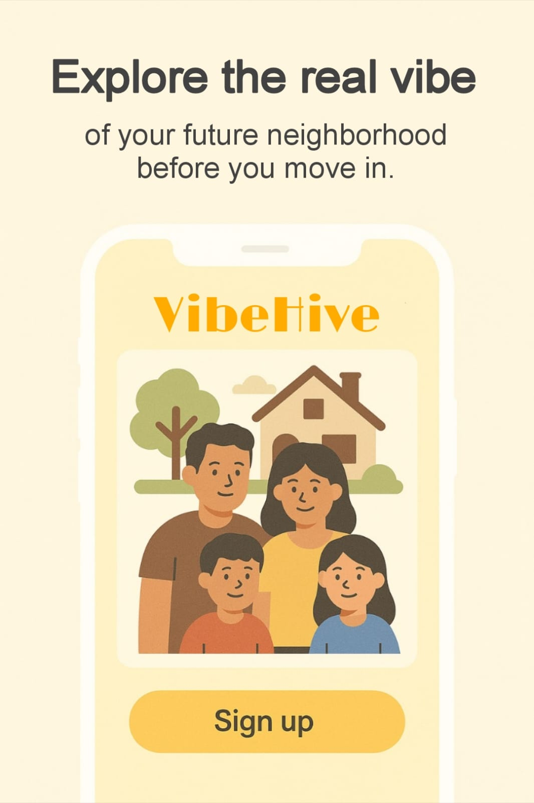
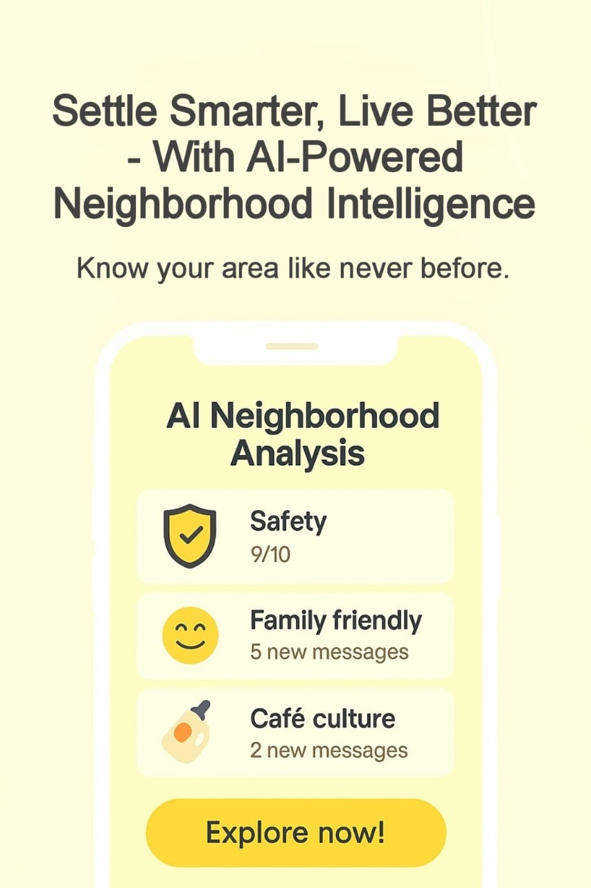
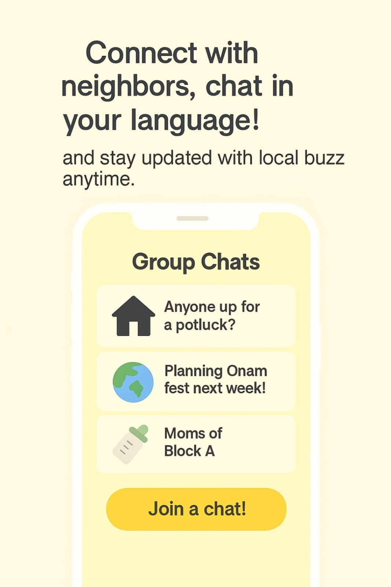
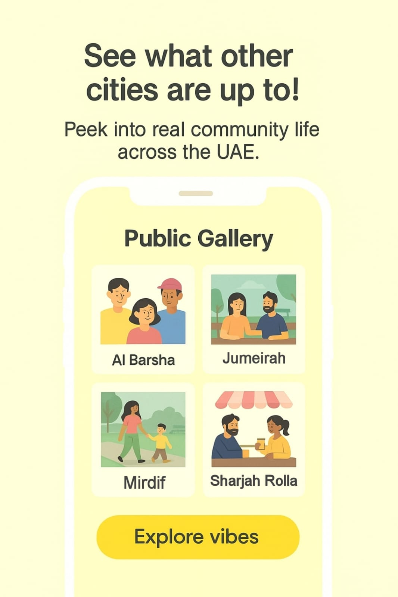
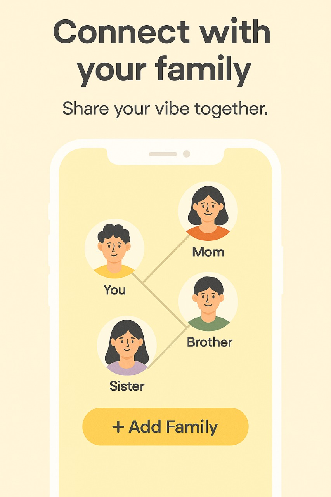

# VibeHive 🌟

**VibeHive** is a family-centered, AI-powered web platform designed to rebuild real neighborhood connections across the UAE. Built with a clean, yellow-themed design, VibeHive blends technology with community to bring neighbors closer than ever.

---

## 🏡 Features

- 🔐 **Secure Login** – Email sign-in with family linking support.
- 🧭 **AI Neighborhood Analysis** – View safety, culture, vibe, and livability scores of UAE areas like Al Barsha, Jumeirah, etc.
- 👨‍👩‍👧‍👦 **Family Onboarding** – Users can register family members under one unit.
- 💬 **Group Chats & Messaging** – Localized chat groups for neighborhoods and interests.
- 🖼️ **Public Gallery** – See what’s happening in other cities through community posts.
- 🎒 **Teen Jobs** – Safe job listings for teens and stay-at-home families.
- ☕ **Café Updates** – Community businesses can post exclusive offers and live events happening.
- 🛍️ **Community Commerce** – Buy, sell, or donate used items locally.

---

## 📸 What VibeHive Can Do?

| Homepage | AI Analyzer | Chats | Public Gallery |
|----------|-------------|-------|----------------|
|  |  |  |  |

| Family Onboarding | Teen Jobs | Café Deals | Marketplace |
|-------------------|-----------|------------|-------------|
|  |  |  |  |

---

## 📱 Tech Stack

- HTML5, CSS3
- Responsive Design
- JavaScript (minimal frontend interactivity)
- Modular layout (home, chat, public-gallery, cafe updates, teen-jobs, AI analysis, community commerce, profile, etc.)

---

## 🎯 Vision

VibeHive aims to restore neighborhood trust, promote safe housing choices, and encourage real-world connections in a digital world — especially for families, newcomers, and youth.

---

## 📌 Project Status

🟢 In Progress — Initial version completed. Further improvements planned for responsiveness and adding an Arabic Interface.

---

## 🤝 Contributing

Pull requests are welcome. If you'd like to contribute to design, responsiveness, or future features, feel free to submit a PR.

📌 By contributing, you agree that your submissions will become part of the proprietary codebase and licensed accordingly.

---

## 🧑‍💻 Author

Made with 💛 by Lubna Saleem

UAE-based student passionate about using tech to rebuild real-world connections 🌍
